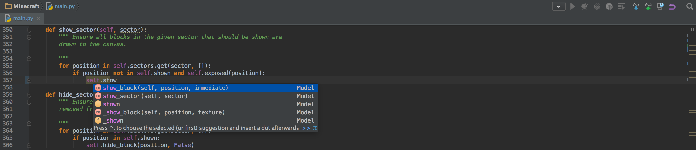
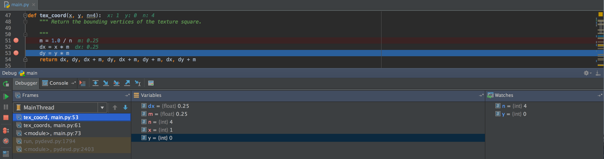

Today, I write some notes about my favorite Python IDE - <strong>PyCharm</strong>. I believe it's a good one for developing python, which supports git, vim, etc. This list below contains my favorite features.

## Pycharm Features

* Intelligent Editor
* Navigation
* Graphical Debugger
* Refactorings
* Code Inspections
* Version Control Integration
* Scientific Tools

### Intelligent Editor

PyCharm provides smart code completion, code inspections, on-the-fly error highlighting and quick-fixes, along with automated code refactorings and rich navigation capabilities.



**Syntax Highlighting**

Read your code easier with customizable colors for Python code and Django templates. Choose from several predefined color themes.

**Auto-Identation and code formating**

Automatic indents are inserted on new line. Indent verification and code re-formatting are compliant with project code-style settings.

**Configurable code styles**

Select a predefined coding style to apply to your code style configuration for various supported languages.

**Code completion**

Code completion for keywords, classes, variables, etc. as you type or via Ctrl+Space. Editor suggestions are context-aware and offer the most appropriate options.

Keyboard shortcuts: `Tab`, `Alt+Enter`

**Code selection and comments**

Select a block of code and expand it to an expression, to a line, to a logical block of code, and so on with shortcuts. Single keystroke to comment/uncomment the current line or selection.

**Code formatter**

Code formatter with code style configuration and other features help you write neat code that's easy to support. PyCharm contains built-in PEP-8 for Python and other standards compliant code formatting for supported languages.

**Code snippets and templates**

Save time using advanced customizable and parametrized live code templates and snippets.


Keyboard shortcuts `check.if ENTER`

```
if check:
  type_something
```

**Code folding**

Code folding, auto-insertion of braces, brackets & quotes, matching brace/bracket highlighting, etc.

**On-the-fly error highlighting**

Errors are shown as you type. The integrated spell-checker verifies your identifiers and comments for misspellings.

**Multiple carets and selections**

With multiple carets, you can edit several locations in your file at the same time.

Keyboard shortcuts: `SHIFT + F6`

**Code analysis**

Numerous code inspections verify Python code as you type and also allow inspecting the whole project for possible errors or code smells.

**Quick-fixes**

Quick-fixes for most inspections make it easy to fix or improve the code instantly. Alt+Enter shows appropriate options for each inspection.

Keyboard shortcuts: `F2`

**Duplicated code detector**

Smart duplicated code detector analyzes your code and searches for copy/pasted code. You'll be presented with a list of candidates for refactoring—and with the help of refactorings it's easy to keep your code dry.

**Configurable language injections**

Natively edit non-Python code embedded into string literals, with code completion, error-highlighting, and other coding assistance features.

**Code auto generation**

Code auto-generation from usage with quick-fixes; docstrings and the code matching verification, plus autoupdate on refactoring. Automatic generation of a docstring stub (reStructuredText, Epytext, Google, and NumPy).

**Intention actions**

Intention actions help you apply automated changes to code that is correct, to improve it or to make your coding routine easier.

**Searching**

Keyboard shortcuts: `Double Shift` (search everywhere)

### Navigation

**Shortcuts**

Keyboard shortcuts: `ALT + SHIFT + UP/DOWN` (move line up and down)

### Graphical Debugger

PyCharm provides extensive options for debugging your Python/Django and JavaScript code:

* Set breakpoints right inside the editor and define hit conditions
* Inspect context-relevant local variables and user-defined watches, including arrays and complex objects, and edit values on the fly
* Set up remote debugging using remote interpreters
* Evaluate an expression in runtime and collect run-time type statistics for better autocompletion and code inspections
* Attach to a running process
* Debug Django templates



**Inline Debugger**

With an inline debugger, all live debugging data are shown directly in the editor, with variable values integrated into the editor's look-and-feel. Variable values can be viewed in the source code, right next to their usages.

**Step into My Code**

Use Step into My Code to stay focused on your code: the debugger will only step through your code bypassing any library sources.

**Multi-process debugging**

PyCharm can debug applications that spawn multiple Python processes, such as Django applications that don't run in --no-reload mode, or applications using many other Web frameworks that use a similar approach to code auto-reloading.

**Run/Debug configurations**

Every script/test or debugger execution creates a special 'Run/Debug Configuration' that can be edited and used later. Run/Debug Configurations can be shared with project settings for use by the whole team.

### Workspace

<h3>Custom Scheme</h3>

Go to <code>File - Settings...</code> then <code>Editor - Colors Fonts</code>

Now you can change your scheme, I like <em>Darcular</em>


### IPython Support

PyCharm supports usage of IPython magic commands.


### Vim Support

You can configure PyCharm to work as a Vim editor


Keyboard Shortcuts: `Ctrl+Shift+V` (paste)
